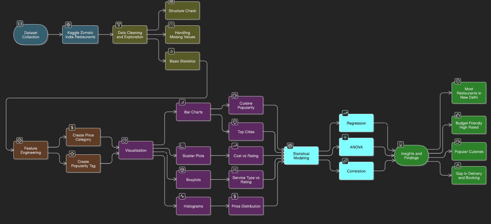
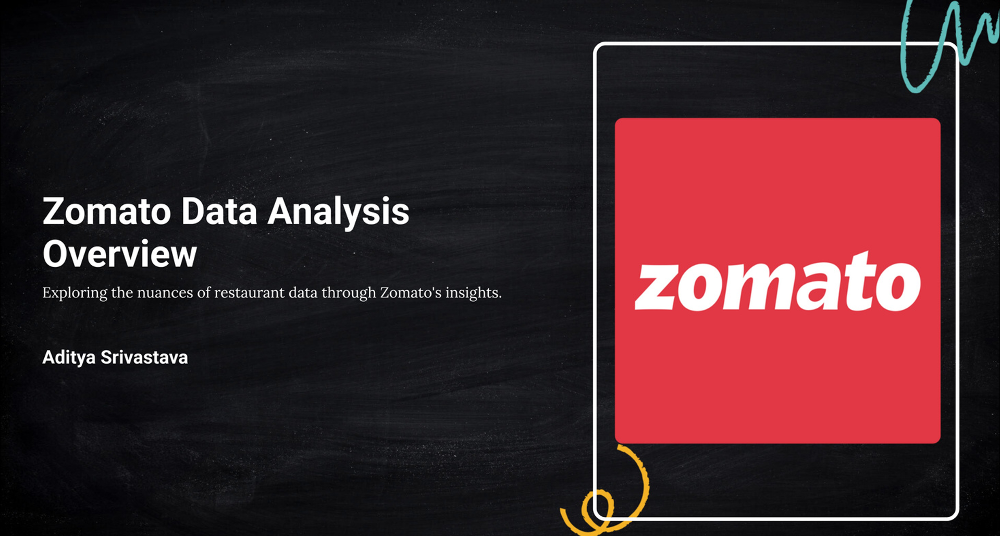
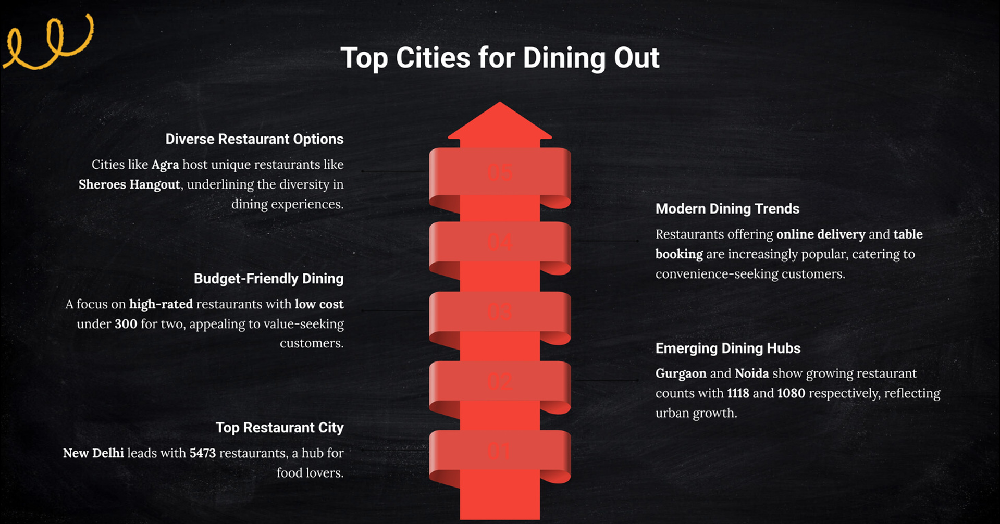

# 🍽️ Zomato India Restaurant Data Analysis | R, ggplot2, dplyr  

Analyzed **9,500+ restaurant records from Kaggle** using R to uncover customer preferences, pricing patterns, cuisines, and city-wise restaurant trends. The project combined **data cleaning, feature engineering, statistical analysis, and visual storytelling** to deliver actionable insights for the food-tech industry.  

---

## 🖼️ Project Workflow  

  
*Raw Data → Cleaning (R & dplyr) → Feature Engineering → Visualization (ggplot2) → Insights & Impact*  

---

## 📊 Dashboard & Visualization Preview  

*Key charts: Cuisine popularity, cost-rating scatter plots, city-wise restaurant trends*  

---

## 🧩 Problem Statement  

Zomato, one of India’s largest food delivery and discovery platforms, wants to:  
- Understand **customer preferences** across cities and cuisines  
- Identify **budget-friendly yet top-rated restaurants**  
- Study **pricing vs. rating patterns** across cuisines and cities  
- Explore **service gaps** like online delivery & table booking availability  

---

## 🛠️ Tools & Technologies  

| Tool / Library | Purpose |
|----------------|---------|
| R              | Core analysis & modeling |
| dplyr, tidyr   | Data cleaning & feature engineering |
| ggplot2        | Data visualization |
| RPubs          | Project publishing |

---

## 🚀 Approach  

1. **Exploration & Cleaning**  
   - Verified dataset quality (no missing values)  
   - Checked structure, columns, and rating distributions  

2. **Feature Engineering**  
   - Created `PriceCategory` (Low/Medium/High)  
   - Created `PopularityTag` (Popular/Regular)  

3. **Visualization (ggplot2)**  
   - Cuisine popularity (bar plots)  
   - Cost vs Rating trends (scatter plots & smooth lines)  
   - PriceCategory distribution (pie charts)  
   - Top Cities by popularity & affordability  

4. **Statistical Modeling**  
   - Regression (simple, multiple, polynomial)  
   - ANOVA tests for city, cuisine, and service impact  
   - Correlation analysis for delivery & booking  

---

## 📊 Key Insights  

🔹 **New Delhi** dominates with the highest number of restaurants and budget-friendly, top-rated spots  
🔹 Restaurants with **Cost < ₹300 & Rating ≥ 4.0** are clustered in Delhi – a valuable low-cost, high-value segment  
🔹 **North Indian, Chinese, and Fast Food** cuisines dominate across cities  
🔹 **Market Gap**: Very few restaurants offer both online delivery & table booking, despite customer demand  
🔹 **Panchkula, Chennai, and Bangalore** have the highest % of popular restaurants  

---

## 🌟 Business Impact  

✅ **Targeted Marketing**: Highlight affordable, highly-rated restaurants for promotions  
✅ **Market Expansion**: Address delivery + table booking service gap to capture demand  
✅ **Customer Engagement**: Focus on popular cuisines like North Indian & Chinese  
✅ **Revenue Growth**: Introduce dynamic pricing for High-Price categories in metros  
✅ **Operational Insights**: Use regression & ANOVA to optimize service strategies  

---

## 📦 Repository Contents  

- `zomato.csv` → Raw Kaggle dataset  
- `zomato_analysis.R` → R scripts (cleaning, feature engineering, analysis)  
- `zomato_visuals.R` → ggplot2 visualization scripts  
- `README.md` → Documentation  

---

## 🔮 Future Enhancements  

- Add **time-based analysis** (restaurant trends over years)  
- Build a **Shiny dashboard** for interactive exploration  
- Apply **ML models** for restaurant rating prediction  

---

## 📎 Project Links  

📌 Dataset: [Kaggle Zomato Restaurants](https://lnkd.in/eDnH3MQY)  
📌 Project Report: [RPubs Link](https://rpubs.com/Adityasri8626/1302988)  

---

## 👤 Author  

**Aditya Srivastava**  
📌 [GitHub](https://github.com/Adityasri8626) | [LinkedIn](https://www.linkedin.com/in/aditya-srivastava8626/)  
